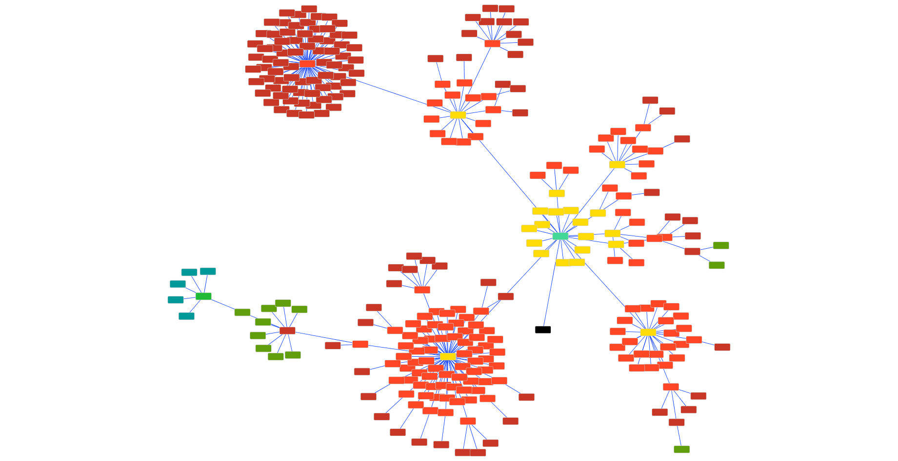

# ggMatch
Greedy Gene Matching tool.

ggMatch finds reciprocal best blast/diamond hits across a large number of genomes, without having to do the dreaded all-vs-all blast.



## Usage

### Dependencies

 - Snakemake
 - Conda

### Running the example

You can download and run the example dataset with the following commands:

```bash
  git clone https://github.com/thiesgehrmann/ggMatch.git
  cd ggMatch
  ./ggMatch example/config.json
```

The --nolock argument is important, since I call a sub-instance of snakemake in the main snakemake file.

The example is defined by the json file in [example/config.json].

### Output


### Running your own problem

Please look at the example JSON file, and the default parameters in (pipeline_components/defaults.json)
